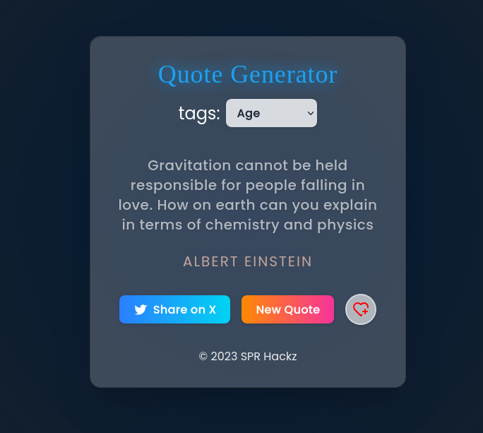

I have forked an uncooked version of the original repository to add some features and fix some bugs.  
The original repository is available at https://github.com/selvin-paul-raj/Quote-Generator-React-App

# Quote Generator React App

This is a simple React application that generates random quotes. It uses the `useState` and `useEffect` hooks to manage state and side effects, respectively. The app fetches quotes from an external API and displays them on the screen.

## Features

- Fetches random quotes from an external API
- Displays the quote and author
- Allows users to generate a new quote
- Responsive design

### New Features Added in This Fork

- Separated quotes from tags for better clarity
- Improved and consistent layout across the app
- Bug fixes for smoother user experience
- Enhanced UI responsiveness
- (Add any other features you have introduced here)

## Screenshots

<!-- Add images/screenshots of the app here -->
<!-- Example: -->


<!--  -->

## Technologies Used

- React
- JavaScript
- CSS
- HTML

## Installation

1. Clone the repository:
   ```bash
   git clone https://github.com/rock-das-codes/Quote-Generator-React-App
   ```

2. Install dependencies:
   ```bash
   cd Quote-Generator-React-App
   npm install
   ```

3. Run the app:
   ```bash
   npm run dev
   ```
